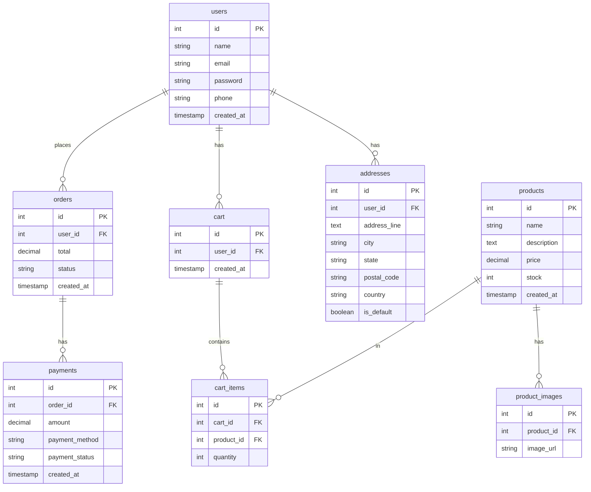

# EStore Website
```It is a simple ECommerce Website using Flask and MySQl as DB. ```

## Frontend

## Backend

## Database

### ER Diagram


```mermaid
erDiagram
    users ||--o{ addresses : "has"
    users ||--o{ cart : "has"
    users ||--o{ orders : "places"
    products ||--o{ product_images : "has"
    cart ||--o{ cart_items : "contains"
    products ||--o{ cart_items : "in"
    orders ||--o{ payments : "has"

    users {
        int id PK
        string name
        string email
        string password
        string phone
        timestamp created_at
    }

    addresses {
        int id PK
        int user_id FK
        text address_line
        string city
        string state
        string postal_code
        string country
        boolean is_default
    }

    products {
        int id PK
        string name
        text description
        decimal price
        int stock
        timestamp created_at
    }

    product_images {
        int id PK
        int product_id FK
        string image_url
    }

    cart {
        int id PK
        int user_id FK
        timestamp created_at
    }

    cart_items {
        int id PK
        int cart_id FK
        int product_id FK
        int quantity
    }

    orders {
        int id PK
        int user_id FK
        decimal total
        string status
        timestamp created_at
    }

    payments {
        int id PK
        int order_id FK
        decimal amount
        string payment_method
        string payment_status
        timestamp created_at
    }
```
